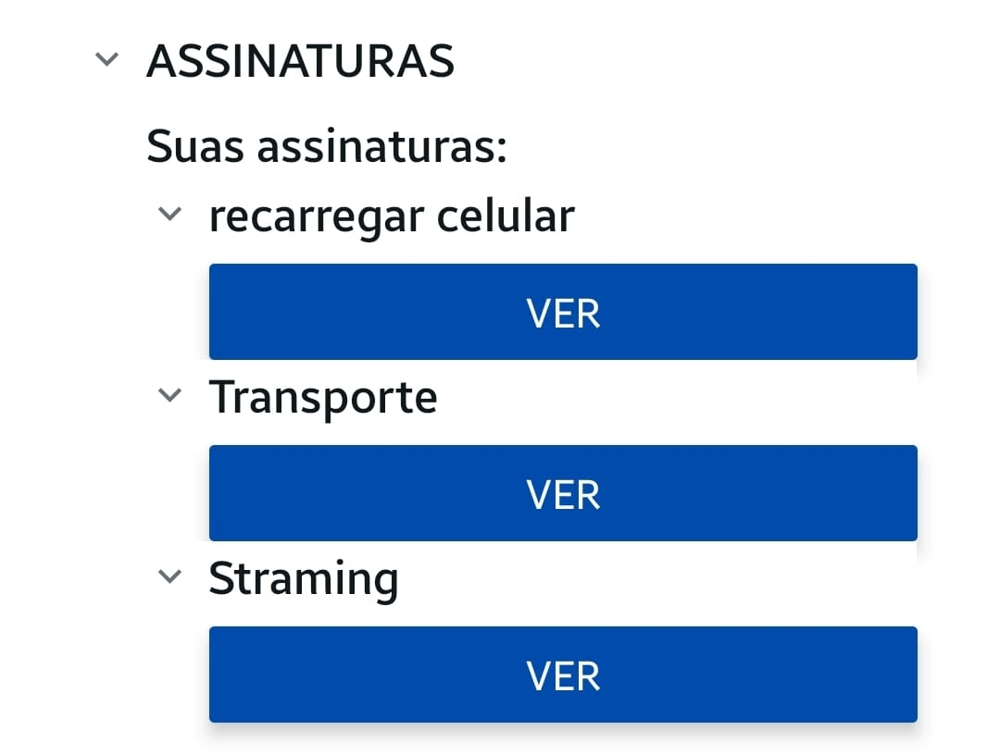
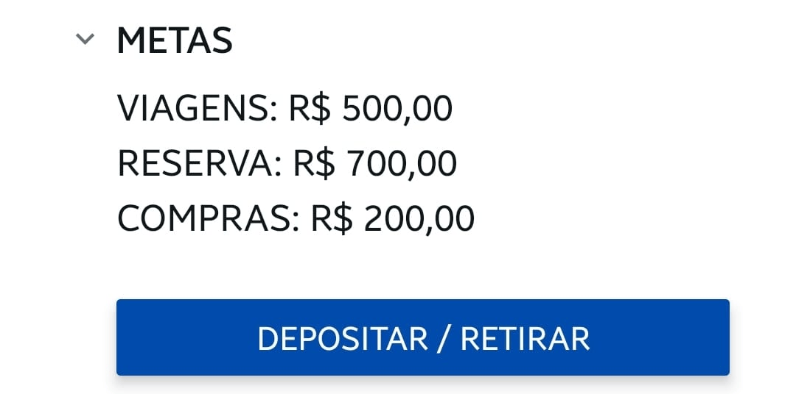
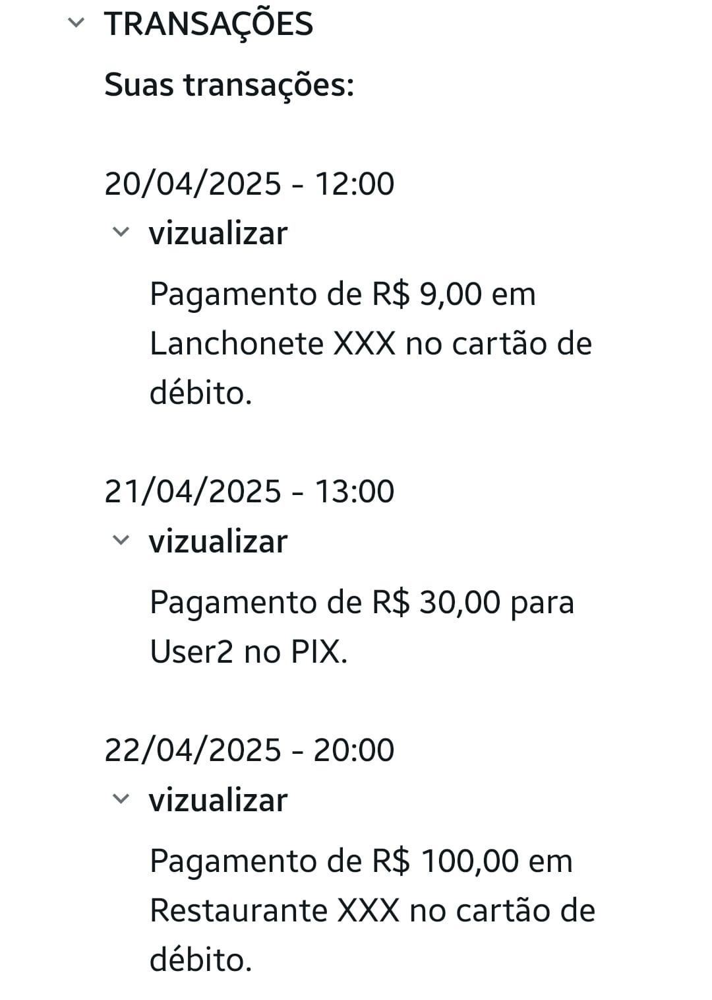

# ➜ PROJETO MOBILE (˶˃ ᵕ ˂˶) .ᐟ.ᐟ

## ➜ SOBRE: ₊⊹ 

Este projeto tem como principal objetivo criar uma interface de um banco digital, visando as principais funcionalidades, opções de caminhos e outras interações do usuário com o app.

## ➜ TECNOLOGIAS USADAS: ₊⊹

1 - HTML e CSS  
2 - Expo Go 
3 - React Native 

## ➜ PÁGINA 1 (conta/home): ₊⊹

## ➜ FUNÇÕES 1: ₊⊹

*LOGO, EXTRATO & SALDO:* Ao abrir o aplicativo do banco, o usuário verá uma visão rápida do seu saldo disponível e a logo do banco. Logo abaixo, haverá a opção "Extrato", que, ao ser selecionada, levará a uma tela com o histórico completo das movimentações bancárias, incluindo entradas, saídas e transações recentes.

*BOTÕES E SUAS FUNÇÕES:* Abaixo do saldo, você encontrará opções para gerenciar seu dinheiro, cada uma com uma função específica,sendo:

*PIX* – Permite transferências rápidas usando chave PIX, QR Code ou CPF/CNPJ.

*PAGAR* – Facilita o pagamento de boletos, contas e tributos.

*TRANSFERIR* – Realiza envio de dinheiro para outras contas.

*DEPOSITAR* – Permite adicionar dinheiro à sua conta via boleto, depósito em espécie (em caixas eletrônicos) ou transferência de outra conta.

*CARTÕES* Nesta seção, SE gerencia tanto o cartão virtual quanto o cartão físico vinculados à sua conta. Cada um oferece funcionalidades específicas:

*Cartão Virtual* – Ao acessá-lo, você visualiza todos os dados do cartão, incluindo:Número do cartão, data de validade, código de segurança (CVV) e limite disponível
(Ideal para compras online com segurança)

Cartão Físico – Aqui você encontra opções avançadas, como: Ativar/desativar pagamento por aproximação,solicitar segunda via, consultar e alterar senha do cartão e bloquear temporariamente em situações de suspeita de fraude.

*Conta e Menu:* Em resumo, essas opções mostram qual página esta sendo usada e os icones representam de forma gráfica.

## ➜  PÁGINA 2 (menu/explore): ₊⊹

## ➜ FUNÇÕES 2: ₊⊹

*CARTÃO DE CRÉDITO:* mostra as condições do cartão do usuário, apresentando sua fatura e quanto de limite ainda possui.

*ASSINATURAS:* área dedicada a todos os serviços que o usuário paga ou que deseja adiquirir.

*METAS:* funciona como uma "caixinha" ou "cofrinho", onde pode-se adicionar dinheiro a objetivos específicos do usuário, ou retirar esse dinheiro direto a sua conta.

*TRANSAÇÕES:* de forma simplificada, mostra suas movimentações recentes e o acesso ao histórico completo com todos os detalhes como data, horário e local de cada transação.

*AGÊNCIA E SUPORTE:* a opção "agência da conta" permite visualizar o número da agência e conta corrente do usuário.E a opção "suporte" da acesso direto ao chat de ajuda, FAQs e canais de atendimento 24h.
